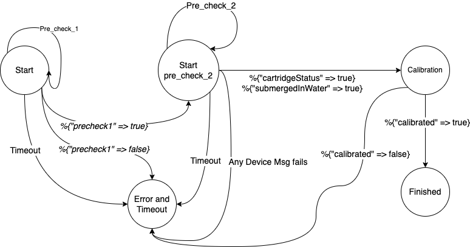

# Solution for Calibrating a Pool Chemistry Monitoring Device

## Installation

Used Elixir version `1.13.4-otp-25`

This starter was created using erlang 22.3.4.12 and Elixir 1.13.4-otp-25 but should be compatible
with other versions as well. This project supports managing your erlang and Elixir
installations with [asdf](https://github.com/asdf-vm/asdf) (with the
[asdf-erlang](https://github.com/asdf-vm/asdf-erlang) and
[asdf-elixir](https://github.com/asdf-vm/asdf-elixir) plugins) if you choose.

After forking and cloning the repository, install dependencies:

```mix deps.get```

Then compile the project:

```mix compile```

Run tests:

```mix test```

## Approaching the problem

After going through the [calibration-flow.pdf](calibration-flow.pdf) I arrived to a conculsion that we're trying to build a state machine. Here's a simplified version of the `calibration-flow`



The Solution is architected into the following

- `Core` - Responsible for the business logic (Calibration flow). It holds the flows of calibration and other business related functions without any elixir/erlang constructs.

- `Boundary` - Uses the Core module and applies the elixir OTP concepts and other features to achieve concurrency. Incase If we want to change or deal with the scaling, we can do modifications here without worrying about breaking business rules.

### Architecture


### Concurreny through Dynamic Supervisor

Going through the problem, I realized that [Dynamic Supervisor](https://hexdocs.pm/elixir/DynamicSupervisor.html) is the right choice for the problem.

>Dynamic Supervisor is used to create and manage GenServer process on demand and stop them when they are not required.

*Reasons*:

- Since the calibration flow is driven on demand and lasts no more than a minute, It is easier to create calibration processes on demand.
- Once the calibration is over, we can recover memory and system resources by stopping the GenServer process.
